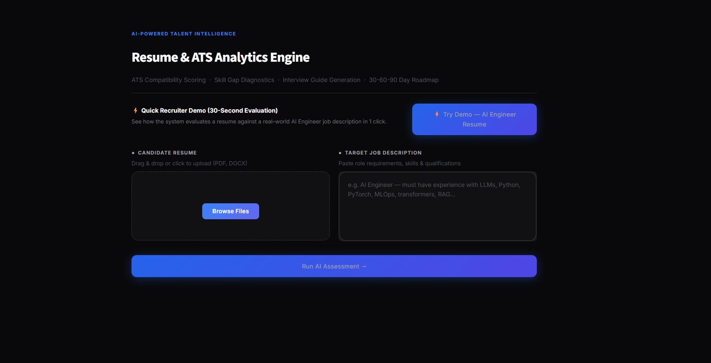
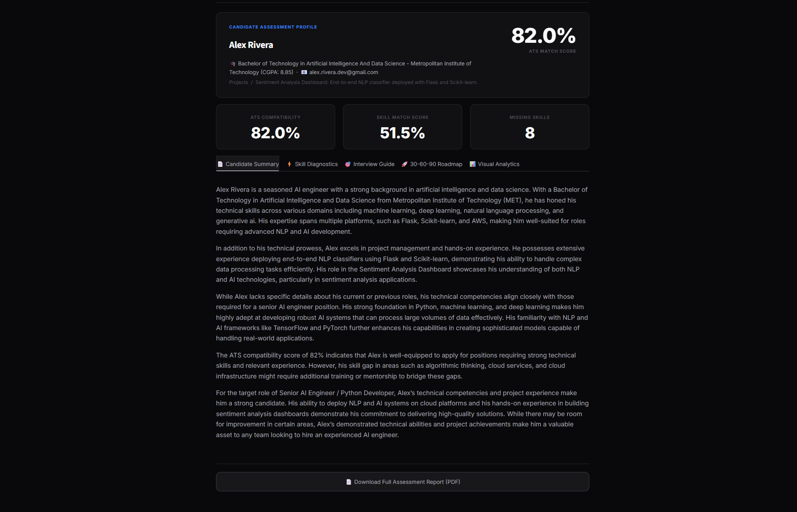
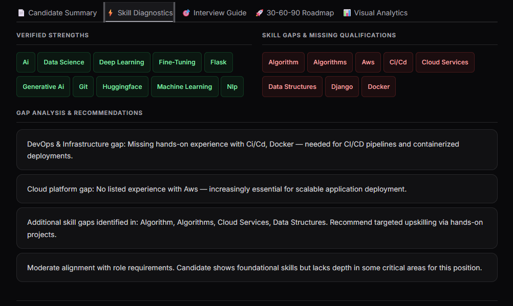
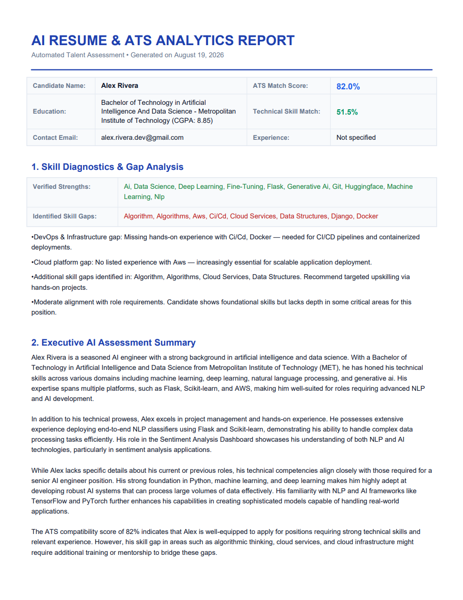

# AI Hiring Assistant

> **An end-to-end NLP talent intelligence platform that evaluates candidate resumes against job descriptions — delivering hybrid ATS compatibility scoring, skill gap diagnostics, LLM-generated interview preparation guides, interactive visual analytics, and structured PDF reports.**

[](https://github.com/HARIHRITHIK/ai-hiring-assistant/actions)
[](https://python.org)
[](https://huggingface.co)
[](LICENSE)

---

## 🚀 Live Demo

> **Live Demo:** [ADD LIVE DEMO URL HERE]

*(Deployable on Streamlit Community Cloud with zero-cost CPU infrastructure · No login or API keys required)*

---

## 📸 Preview

| Dashboard & Inputs | Candidate Profile & ATS Score |
|:---:|:---:|
|  |  |

| Skill Diagnostics & Visual Analytics | Downloadable PDF Assessment Report |
|:---:|:---:|
|  |  |

### Adding Screenshots to GitHub
1. Open the `assets/screenshots/` folder in your repository.
2. Click **Add file** $\rightarrow$ **Upload files**.
3. Upload your UI screenshots using these exact filenames: `dashboard.png`, `analysis-results.png`, `skill-analysis.png`, `report.png`.
4. Commit the change; GitHub will automatically render them above.

---

## Problem

- **High Screening Latency:** Engineering managers and recruiters spend hours manually screening resumes against technical job descriptions.
- **Keyword Stuffing Exploits:** Legacy keyword-matching ATS software can be tricked by repeating keywords without semantic relevance.
- **Unstructured Technical Interviews:** Interviewers often ask generic trivia rather than targeted questions assessing candidate-specific gaps and project depth.

---

## Solution

The **AI Hiring Assistant** provides an automated, objective evaluation pipeline that:
1. Ingests candidate resumes in **PDF** or **DOCX** format.
2. Computes an **objective hybrid ATS score** combining dense vector semantic similarity with lexical skill taxonomy matching.
3. Automatically identifies **verified strengths** and **missing qualifications**.
4. Dynamically generates **candidate-specific interview questions** with evaluation criteria and a **30-60-90 day learning roadmap**.
5. Compiles an **in-memory executive PDF report** ready for hiring managers and candidate debriefs.

---

## Key Features

- ⚡ **1-Click 30-Second Recruiter Demo:** Evaluate a pre-configured AI Engineer profile against a real-world job description in one click without uploading a file.
- 📄 **Multi-Format Ingestion:** Robust text extraction supporting multi-page PDF files (`pdfplumber`) and Word documents (`python-docx`).
- 🎯 **Hybrid ATS Compatibility Engine:** Combines dense vector cosine similarity (`all-MiniLM-L6-v2`) with a curated 200+ skill taxonomy and role-aware domain expansion.
- 🧠 **Local Open-Source LLM Inference:** Generates executive summaries, interview guides, and roadmaps using quantized `Qwen2.5-0.5B-Instruct` on CPU (`torch.float16`) with zero API costs.
- 📊 **Visual Analytics Dashboard:** Dark-theme Plotly charts including an ATS score gauge and a stacked skill distribution comparison.
- 📑 **In-Memory Corporate PDF Export:** Generates formatted multi-page PDF evaluation reports using `ReportLab 4.x` with safe XML character escaping.
- 🧪 **Automated Testing Suite:** 18 deterministic unit tests (`pytest`) integrated with GitHub Actions CI.

---

## How It Works

```
Resume (PDF/DOCX) + Job Description
              ↓
  Multi-Format Text Extraction
              ↓
  spaCy NER & Regex Metadata Extraction
              ↓
  Dense Vector Semantic Similarity (all-MiniLM-L6-v2)
              ↓
  Curated Skill Taxonomy Matching (200+ Skills + Domain Expansion)
              ↓
  Hybrid Ensemble Scoring (50% Semantic + 50% Lexical Match)
              ↓
  Causal LM Text Generation (Qwen2.5-0.5B-Instruct fp16)
              ↓
  Interactive Streamlit UI + ReportLab PDF Report Export
```

---

## Architecture

```
┌─────────────────────────────────────────────────────────┐
│                    Streamlit Frontend                    │
│   (dark-mode UI · 1-click demo · visual charts · PDF)   │
└────────────────────┬────────────────────────────────────┘
                     │
         ┌───────────▼────────────┐
         │    Document Parser     │
         │  pdfplumber · docx     │  ← Layer 1: Multi-Format Extraction
         └───────────┬────────────┘
                     │
         ┌───────────▼────────────┐
         │   NLP Pre-processing   │
         │  spaCy · regex · NER   │  ← Layer 2: Entity & Skill NER
         └───────────┬────────────┘
                     │
         ┌───────────▼────────────┐
         │  Semantic Embedding    │
         │  sentence-transformers │  ← Layer 3: Dense Vector Similarity
         │  (all-MiniLM-L6-v2)   │
         └───────────┬────────────┘
                     │
         ┌───────────▼────────────┐
         │   ATS Scoring Engine   │
         │  cosine sim + keyword  │  ← Layer 4: Hybrid Ensemble
         │  domain expansion      │
         └───────────┬────────────┘
                     │
         ┌───────────▼────────────┐
         │   LLM Generation       │
         │  Qwen2.5-0.5B-Instruct │  ← Layer 5: Causal LM (HuggingFace)
         │  (CPU-optimised fp16)  │
         └───────────┬────────────┘
                     │
         ┌───────────▼────────────┐
         │   ReportLab PDF Engine │  ← Layer 6: Executive PDF Output
         └────────────────────────┘
```

> For comprehensive architecture documentation and component data flow, see [docs/ARCHITECTURE.md](docs/ARCHITECTURE.md).

---

## Technology Stack

| Layer | Technology | Purpose |
|---|---|---|
| **Frontend UI** | Streamlit | Responsive dark-mode web application & interactive tabs |
| **Document Ingestion** | pdfplumber, python-docx | Text extraction across PDF pages and Word documents |
| **NLP & Entity NER** | spaCy, regex | Metadata extraction (Name, Education, Contact, Projects) |
| **Semantic Embeddings** | sentence-transformers | 384-dimensional dense vector embeddings (`all-MiniLM-L6-v2`) |
| **Causal LLM** | Hugging Face Transformers | Local CPU inference for text generation (`Qwen2.5-0.5B-Instruct`) |
| **Scoring Engine** | NumPy, scikit-learn | Cosine similarity & weighted hybrid ATS ensemble |
| **Visual Analytics** | Plotly | Dark-mode ATS compatibility gauge & skill distribution bar |
| **PDF Generation** | ReportLab 4.x | In-memory corporate candidate assessment report compilation |
| **Automated Testing** | Pytest | 18 unit and integration tests |
| **CI / CD** | GitHub Actions | Automated test execution on every commit and pull request |

---

## Example Workflow

For a detailed 2-minute walkthrough, see [DEMO.md](DEMO.md).

1. **Input:** Upload candidate resume (`.pdf` or `.docx`) and paste target job description.
2. **Analysis Execution:** Click **`Run AI Assessment →`** (or click **`⚡ Try Demo`**).
3. **Review Profile:** Inspect candidate metadata, calculated ATS match percentage, and score cards.
4. **Explore Tabs:**
   - 📄 **Candidate Summary:** Executive summary covering academic background, competencies, and role alignment.
   - ⚡ **Skill Diagnostics:** Verified matching skills vs. missing qualifications.
   - 🎯 **Interview Guide:** Targeted technical interview questions with interviewer evaluation criteria.
   - 🚀 **30-60-90 Roadmap:** Structured learning roadmap targeting identified skill gaps.
   - 📊 **Visual Analytics:** Interactive ATS gauge and skill distribution charts.
5. **Export:** Click **`📄 Download Full Assessment Report (PDF)`** to download the structured assessment document.

---

## Testing

The project includes an automated test suite verifying document parsers, NLP embeddings, deterministic scoring bounds, XML safety in PDF generation, and Plotly visual figures.

```bash
# 1. Clone repository
git clone https://github.com/HARIHRITHIK/ai-hiring-assistant.git
cd ai-hiring-assistant

# 2. Create and activate virtual environment
python -m venv .venv
.venv\Scripts\activate          # Windows
# source .venv/bin/activate     # macOS / Linux

# 3. Install dependencies
pip install -r requirements.txt
pip install pytest

# 4. Run test suite
pytest tests/ -v
```

```
============================= test session starts =============================
tests/test_data_processing.py::test_clean_job_description_basic PASSED   [  5%]
tests/test_data_processing.py::test_clean_job_description_empty PASSED   [ 11%]
tests/test_data_processing.py::test_parse_resume_invalid_file PASSED     [ 16%]
tests/test_data_processing.py::test_parse_resume_unsupported_extension PASSED [ 22%]
tests/test_data_processing.py::test_parse_resume_empty_file PASSED       [ 27%]
tests/test_nlp_scoring.py::test_skill_set_integrity PASSED               [ 33%]
tests/test_nlp_scoring.py::test_domain_expansion_integrity PASSED        [ 38%]
tests/test_nlp_scoring.py::test_skill_extraction_nlp PASSED              [ 44%]
tests/test_nlp_scoring.py::test_job_title_filter PASSED                  [ 50%]
tests/test_nlp_scoring.py::test_embeddings_generation PASSED             [ 55%]
tests/test_nlp_scoring.py::test_deterministic_scoring_bounds PASSED      [ 61%]
tests/test_nlp_scoring.py::test_candidate_metadata_extraction PASSED     [ 66%]
tests/test_pdf_report.py::test_escape_xml PASSED                         [ 72%]
tests/test_pdf_report.py::test_format_markdown_for_pdf PASSED            [ 77%]
tests/test_pdf_report.py::test_generate_pdf_report_valid PASSED          [ 83%]
tests/test_visualization.py::test_plot_ats_gauge_structure PASSED        [ 88%]
tests/test_visualization.py::test_plot_ats_gauge_clamping PASSED         [ 94%]
tests/test_visualization.py::test_plot_skill_breakdown PASSED            [100%]
============================= 18 passed in 11.94s =============================
```

---

## Deployment

### Local Deployment
```bash
streamlit run app.py
```

### Streamlit Community Cloud (Zero-Cost Deployment)
1. Fork or push this repository to GitHub.
2. Log in to [share.streamlit.io](https://share.streamlit.io).
3. Select this repository (`ai-hiring-assistant`), branch `main`, and main file path `app.py`.
4. Click **Deploy**. Streamlit Cloud automatically manages dependencies via `requirements.txt`.

---

## Limitations

- **Single-Candidate Evaluation:** Processes one candidate resume against one job description at a time (designed for focused evaluation rather than mass bulk batch processing).
- **CPU Inference Latency:** Running local LLM token generation on free cloud CPU takes approximately 6–10 seconds.
- **Digital Document Text:** Requires selectable text in PDF/DOCX documents; scanned bitmap images without embedded text layers require OCR pre-processing.

---

## Future Improvements

- [ ] Multi-candidate ranker allowing recruiters to upload multiple resumes and rank them against a single job description.
- [ ] OCR integration via `pytesseract` to support image-scanned resumes.
- [ ] Role-specific interview rubrics exportable directly to Notion or Google Docs.

---

## Technical Interview Concepts

When discussing this project during technical interviews, key concepts demonstrated include:

1. **Dense Vector Similarity:** Mapping unstructured text into 384-dimensional dense vectors using `sentence-transformers` and calculating cosine similarity ($\mathbf{u} \cdot \mathbf{v}$).
2. **Hybrid Ensemble Scoring:** Mitigating keyword-stuffing exploits by combining 50% semantic proximity with 50% hard skill taxonomy matching.
3. **Open-Source SLM Serving on CPU:** Optimizing `Qwen2.5-0.5B-Instruct` using `torch.float16` precision and singleton memory persistence to run reliably within 1 GB RAM limits.
4. **Defensive PDF Architecture:** Implementing XML entity sanitization (`saxutils.escape`) to prevent ReportLab expat parser exceptions on special characters (`&`, `<`, `>`).
5. **Automated Testing & CI:** Writing unit and integration test fixtures in `pytest` to guarantee deterministic scoring and parser reliability across commits.

---

## License

This project is licensed under the MIT License — see the [LICENSE](LICENSE) file for details.
